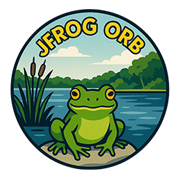

  
  <h1>CircleCI JFrog Orb</h1>
  <i>A CircleCI orb for streamlining JFrog CLI intallation and use.</i>  

   

This unofficial JFrog CLI orb facilitates the installation and execution of the JFrog CLI tool within CircleCI pipelines. Contributions are welcome.
